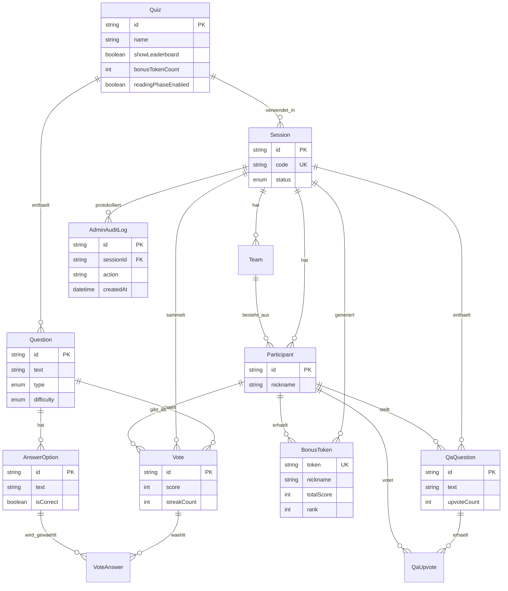
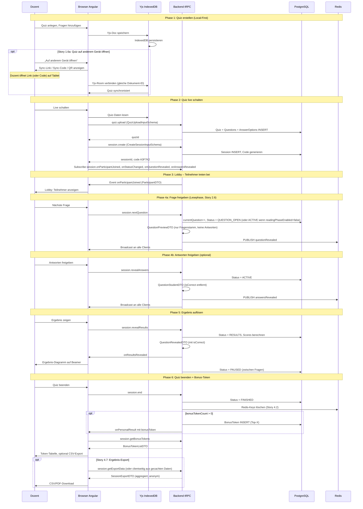
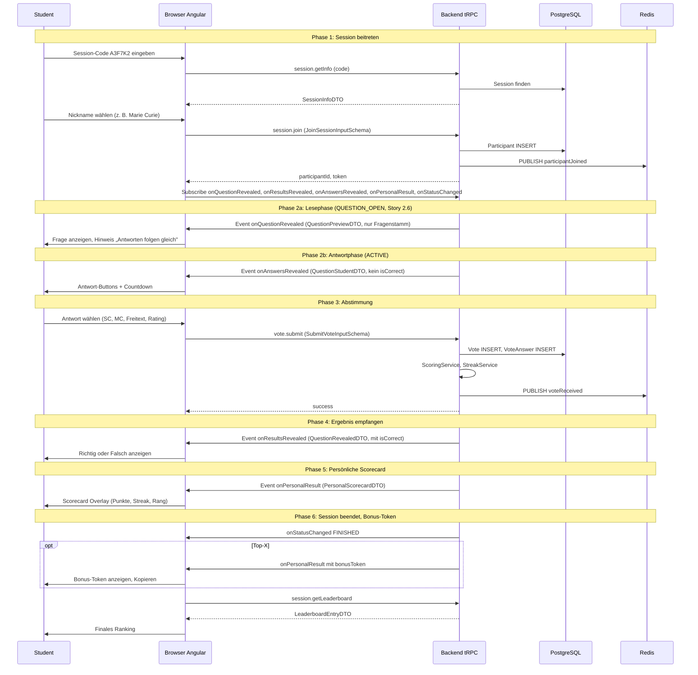
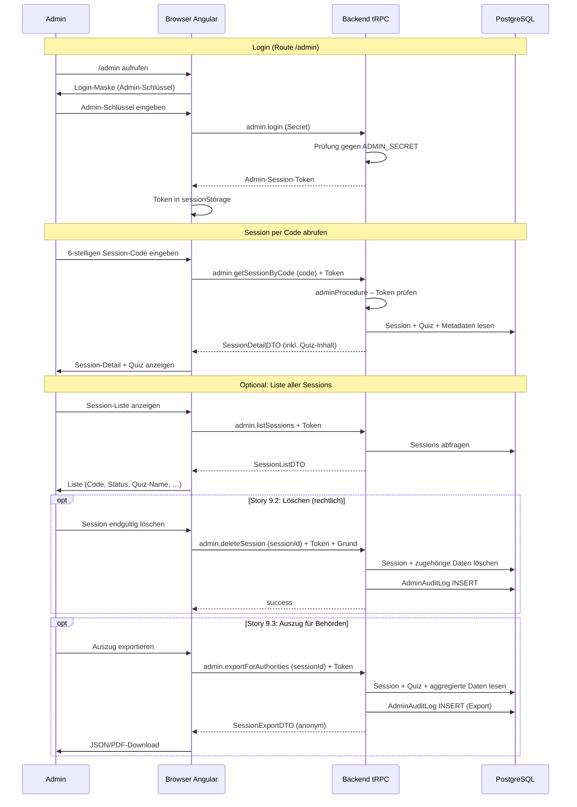

# Diagramme: arsnova.eu

Alle Diagramme sind in Mermaid geschrieben und werden von GitHub nativ gerendert.  
**Stand:** 2026-03-04 · **Epic 0 abgeschlossen;** **Epic 9 (Admin):** Rollen/Routen/Autorisierung siehe [ADR-0006](../architecture/decisions/0006-roles-routes-authorization-host-admin.md), [ROUTES_AND_STORIES.md](../ROUTES_AND_STORIES.md).

> **VS Code:** Mermaid wird in der Standard-Markdown-Vorschau nicht gerendert. Bitte die Erweiterung **„Markdown Preview Mermaid Support“** (`bierner.markdown-mermaid`) installieren. Siehe [README.md](./README.md) in diesem Ordner.

---

## 1. Backend-Architektur (Komponenten)

Express · tRPC · Prisma 7 · Redis · WebSocket · Yjs (Epic 0 umgesetzt; health, stats, ping, Rate-Limit, y-websocket)

```mermaid
graph TB
    subgraph Entry["Entry Point"]
        express[Express Server - Port 3000]
        cors[CORS Middleware]
        trpcmw["tRPC Middleware (trpc)"]
    end

    subgraph Router["appRouter (tRPC)"]
        health[healthRouter]
        quiz[quizRouter]
        session[sessionRouter]
        vote[voteRouter]
        qa[qaRouter]
        admin[adminRouter - Epic 9]
    end

    subgraph Services["Services"]
        scoring[ScoringService]
        streak[StreakService]
        codegen[SessionCodeService]
        cleanup[CleanupService]
        ratelimit[RateLimitService]
        tokenservice[BonusTokenService]
    end

    subgraph DTO["DTO Layer - Data-Stripping"]
        prevdto[QuestionPreviewDTO - Lesephase, nur Fragenstamm]
        studdto[QuestionStudentDTO - kein isCorrect]
        revdto[QuestionRevealedDTO - mit isCorrect]
        sessiondto[SessionInfoDTO]
        lbdto[LeaderboardEntryDTO]
        scoredto[PersonalScorecardDTO]
    end

    subgraph Validation["Validation - shared-types"]
        submitvote[SubmitVoteInputSchema]
        createsession[CreateSessionInputSchema]
        quizupload[QuizUploadInputSchema]
    end

    pg[(PostgreSQL - Prisma 7)]
    redis[(Redis PubSub + Rate-Limit)]
    wss[WebSocket Server]
    yws["y-websocket Relay"]

    express --> cors --> trpcmw
    trpcmw --> health
    trpcmw --> quiz
    trpcmw --> session
    trpcmw --> vote
    trpcmw --> qa
    trpcmw --> admin

    session --> scoring
    session --> streak
    session --> codegen
    session --> cleanup
    session --> tokenservice
    vote --> scoring
    vote --> streak
    vote --> ratelimit
    qa --> ratelimit

    session --> prevdto
    session --> studdto
    session --> revdto
    session --> sessiondto
    session --> lbdto
    session --> scoredto
    vote --> submitvote
    quiz --> quizupload
    session --> createsession

    scoring --> pg
    streak --> pg
    tokenservice --> pg
    cleanup --> pg
    cleanup --> redis
    ratelimit --> redis
    session --> redis
    session --> wss
    express --> yws

    admin --> pg
    admin --> cleanup
```



---

## 2. Frontend-Architektur (Komponenten)

Angular 19 · Standalone Components · Signals · Angular Material 3 + SCSS-Patterns

```mermaid
graph TB
    subgraph Root["Root"]
        app[AppComponent]
        routes[app.routes.ts]
        config[app.config.ts]
    end

    subgraph Shared["Shared Components"]
        header[HeaderComponent]
        footer[FooterComponent]
        theme[ThemeSwitcherComponent]
        lang[LanguageSwitcherComponent]
        countdown[CountdownComponent]
        mdkatex[MarkdownKatexComponent]
        confirm[ConfirmDialogComponent]
    end

    subgraph Home["Home (Root)"]
        home[HomePageComponent]
        status[ServerStatusWidget]
        join[JoinInputComponent]
    end

    subgraph Quiz["Quiz-Verwaltung (Route quiz)"]
        quizlist[QuizListComponent]
        editor[QuizEditorComponent]
        quizconfig[QuizConfigComponent]
        questionedit[QuestionEditorComponent]
        answeredit[AnswerEditorComponent]
        preview[QuizPreviewComponent]
        importexport[ImportExportComponent]
    end

    subgraph Session["Session-Steuerung Dozent (/session/:code/host)"]
        lobby[LobbyComponent]
        control[QuizControlComponent]
        qamoderator[QaModeratorComponent]
        tokenlist[BonusTokenListComponent]
    end

    subgraph Beamer["Beamer (/session/:code/present)"]
        beamer[BeamerViewComponent]
        chart[ResultChartComponent]
        wordcloud[WordcloudComponent]
        histogram[RatingHistogramComponent]
        leaderboard[LeaderboardComponent]
        emojioverlay[EmojiOverlayComponent]
        qrcode[QrCodeComponent]
    end

    subgraph Student["Student (/join/:code → /session/:code/vote)"]
        nickname[NicknameSelectComponent]
        voting[VotingViewComponent]
        buttons[AnswerButtonsComponent]
        mctoggle[McToggleButtonsComponent]
        ratingscale[RatingScaleComponent]
        freetext[FreetextInputComponent]
        scorecard[ScorecardComponent]
        tokendisplay[BonusTokenDisplay]
        motivation[MotivationMessageComponent]
        emojibar[EmojiBarComponent]
        qastudent[QaStudentComponent]
    end

    subgraph Admin["Admin (/admin) - Epic 9"]
        adminlogin[AdminLoginComponent]
        admindash[AdminDashboardComponent]
        admincode[SessionCodeInputComponent]
        adminlist[SessionListComponent]
        admindetail[SessionDetailComponent]
        adminexport[ExportForAuthoritiesComponent]
    end

    subgraph Legal["Legal (/legal/imprint, /legal/privacy)"]
        imprint[ImprintComponent]
        privacy[PrivacyComponent]
    end

    subgraph Services["Services"]
        trpc[trpcClient - httpBatchLink + wsLink]
        yjs["YjsService (IndexedDB + y-websocket)"]
        themesvc[ThemeService]
        i18nsvc[I18nService]
    end

    backend[Backend tRPC]
    idb[(IndexedDB - Yjs CRDT)]
    ws[WebSocket - tRPC Subscriptions]

    app --> routes
    app --> header
    app --> footer
    header --> theme
    header --> lang

    home --> status
    home --> join

    quizlist --> editor
    editor --> quizconfig
    editor --> questionedit
    editor --> preview
    editor --> importexport
    questionedit --> answeredit
    questionedit --> mdkatex
    preview --> mdkatex

    lobby --> control
    control --> beamer
    control --> qamoderator
    control --> tokenlist

    beamer --> chart
    beamer --> wordcloud
    beamer --> histogram
    beamer --> leaderboard
    beamer --> emojioverlay
    beamer --> qrcode
    beamer --> countdown

    nickname --> voting
    voting --> buttons
    voting --> mctoggle
    voting --> ratingscale
    voting --> freetext
    voting --> scorecard
    voting --> countdown
    voting --> emojibar
    voting --> qastudent
    scorecard --> tokendisplay
    scorecard --> motivation

    adminlogin --> admindash
    admindash --> admincode
    admindash --> adminlist
    adminlist --> admindetail
    admindetail --> adminexport

    footer --> imprint
    footer --> privacy

    trpc --> backend
    trpc --> ws
    yjs --> idb
```



---

## 3. Datenbank-Schema (PostgreSQL / Prisma)



**Hinweis (Data-Stripping):** `AnswerOption.isCorrect` wird im Status ACTIVE niemals an Studenten gesendet; erst nach RESULTS-Auflösung (QuestionRevealedDTO).  
**Session-Status (Story 2.6):** `LOBBY → QUESTION_OPEN` (Lesephase, nur Fragenstamm) → `ACTIVE` → `RESULTS` → `PAUSED` → … → `FINISHED`. Optional überspringbar: bei `readingPhaseEnabled=false` geht „Nächste Frage" direkt zu `ACTIVE`.

---

## 4. Kommunikation Dozent-Client ↔ Backend

Vereinfachtes Sequenzdiagramm (tRPC HTTP + WebSocket).



---

## 5. Kommunikation Student-Client ↔ Backend

Vereinfachtes Sequenzdiagramm (tRPC HTTP + WebSocket).



---

## 5b. Kommunikation Admin-Client ↔ Backend (Epic 9)

Admin-Rolle: Inspektion, Löschen, Auszug für Behörden. Autorisierung über Admin-Schlüssel (ADMIN_SECRET), dann Session-Token. Siehe [ADR-0006](../architecture/decisions/0006-roles-routes-authorization-host-admin.md).



---

## 6. Aktivitätsablauf: Dozent · Student · Server · Admin

Vereinfachtes Aktivitätsdiagramm (Quiz-Lifecycle inkl. Admin, Epic 9).

```mermaid
flowchart TB
    subgraph Dozent["Dozent"]
        D1[Quiz erstellen - Yjs IndexedDB]
        D1a[Sync-Link/Key für anderes Gerät anzeigen - Story 1.6a]
        D2[Quiz-Preview - Validierung]
        D3[Live schalten - Session erstellen]
        D4[Session-Code + QR anzeigen]
        D5[Nächste Frage klicken]
        D5b[Antworten freigeben - optional bei Lesephase]
        D6[Ergebnis zeigen]
        D7[Live-Balken aktualisieren]
        D8[Quiz beenden]
        D9[Leaderboard + ggf. Bonus-Token-Tabelle]
    end

    subgraph Server["Server"]
        S1[Quiz-Upload validieren, in PG speichern]
        S2[Session anlegen, Code generieren]
        S3a[Status QUESTION_OPEN, QuestionPreviewDTO - Lesephase]
        S3b[Status ACTIVE, QuestionStudentDTO ohne isCorrect]
        S4[Vote speichern, Scoring, voteCountUpdate]
        S5[Status RESULTS, QuestionRevealedDTO mit isCorrect]
        S5b[Status PAUSED - zwischen Fragen]
        S6[Status FINISHED, ggf. BonusToken generieren]
        S7[admin.login - Token ausgeben]
        S8[admin.listSessions / getSessionByCode]
        S9[admin.deleteSession + AuditLog]
        S10[admin.exportForAuthorities + AuditLog]
    end

    subgraph Student["Student"]
        ST1[Code eingeben, session.getInfo]
        ST2[Nickname wählen, session.join]
        ST3a[Fragenstamm anzeigen - Lesephase]
        ST3b[Antwort-Buttons + Countdown anzeigen]
        ST4[Abstimmung vote.submit]
        ST5[Ergebnis + Scorecard anzeigen]
        ST6[Finales Ranking, ggf. Bonus-Token kopieren]
    end

    subgraph Admin["Admin (Epic 9)"]
        A1[/admin - Login mit Admin-Schlüssel]
        A2[Session-Code eingeben oder Liste anzeigen]
        A3[Session-Detail + Quiz-Inhalt einsehen]
        A4[Optional: Session löschen - rechtlich]
        A5[Optional: Auszug für Behörden exportieren]
    end

    D1 --> D1a
    D1a --> D2 --> D3
    D3 --> S1 --> S2
    S2 --> D4
    D4 --> ST1 --> ST2
    ST2 --> D5
    D5 --> S3a
    D5 -.->|readingPhaseEnabled=false| S3b
    S3a --> ST3a
    ST3a --> D5b
    D5b --> S3b
    S3b --> ST3b --> ST4
    ST4 --> S4
    S4 --> D7
    D7 --> D6
    D6 --> S5
    S5 --> ST5
    ST5 --> S5b
    S5b --> D5
    D8 --> S6
    S6 --> ST6
    ST6 --> D9

    A1 --> S7
    S7 --> A2 --> S8 --> A3
    A3 --> A4
    A4 --> S9
    A3 --> A5
    A5 --> S10
```

**Legende:**  
- **QuestionPreviewDTO (Story 2.6):** In der Lesephase (`QUESTION_OPEN`) nur Fragenstamm, keine Antwortoptionen.  
- **QuestionStudentDTO:** isCorrect wird serverseitig entfernt (Story 2.4).  
- **QuestionRevealedDTO:** isCorrect erst nach expliziter Auflösung (RESULTS).  
- **PAUSED:** Zwischenzustand nach Ergebnis-Anzeige, bevor die nächste Frage gestartet wird.  
- **Lesephase:** Bei `readingPhaseEnabled=false` wird QUESTION_OPEN übersprungen — „Nächste Frage" wechselt direkt zu ACTIVE (D5 → S3b, D5b/ST3a entfallen).  
- **Bonus-Token (Story 4.6):** Nur für Top-X, individuell per onPersonalResult.  
- **Admin (Epic 9):** Eigener Ablauf; Zugriff nur mit Admin-Credentials (ADMIN_SECRET → Session-Token). Route `/admin`; Inspektion, Löschen, Auszug für Behörden; Audit-Log für Lösch- und Export-Aktionen. Siehe ADR-0006.
